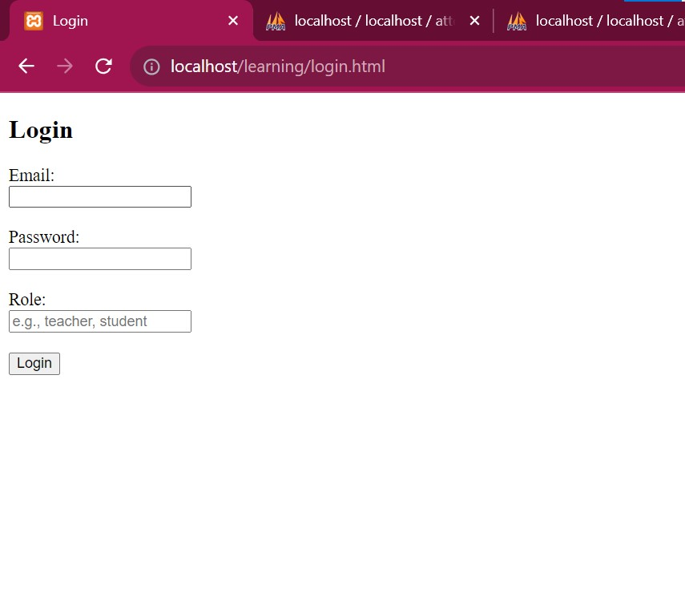

# Attendance Recorder

## Introduction

The Attendance Recorder lab project aimed to create a robust web-based system for managing and recording attendance for students in a course. The system utilized PHP as the primary programming language along with a MySQL database to store student, teacher, course, enrollment, and attendance-related information.

## Functionalities

### User Authentication

- The system implemented user authentication for both students and teachers.
- Passwords were securely stored using PHP's `password_hash()` and `password_verify()` functions.

### Student Dashboard

- Upon successful login, students were redirected to a dashboard displaying their attendance details.
- The dashboard presented the student's name, email, previous attendances, and the percentage of attendance in each subject.

### Teacher Dashboard

- Teachers, upon login, accessed a dashboard showcasing the courses they were teaching.
- Functionalities included taking attendance for enrolled students in respective courses and viewing past attendance records.

### Attendance Recording

- The system allowed teachers to mark students as 'present' or 'absent' for a particular session.
- PHP functions were used to process the submitted attendance data and insert/update records in the database accordingly.

## Website

